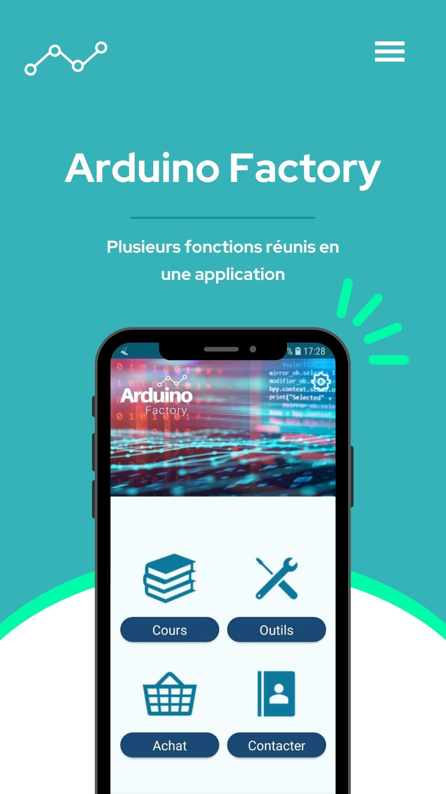
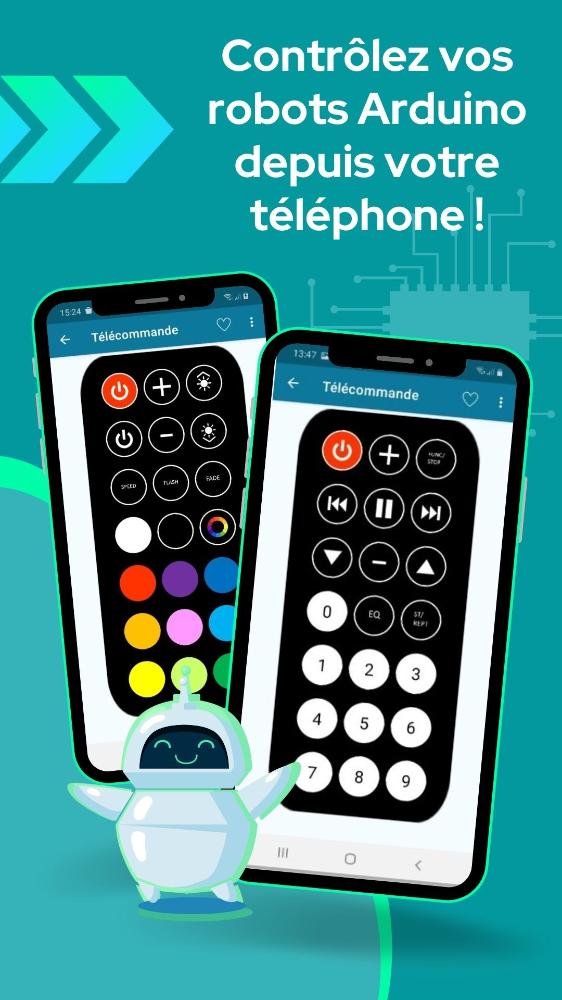
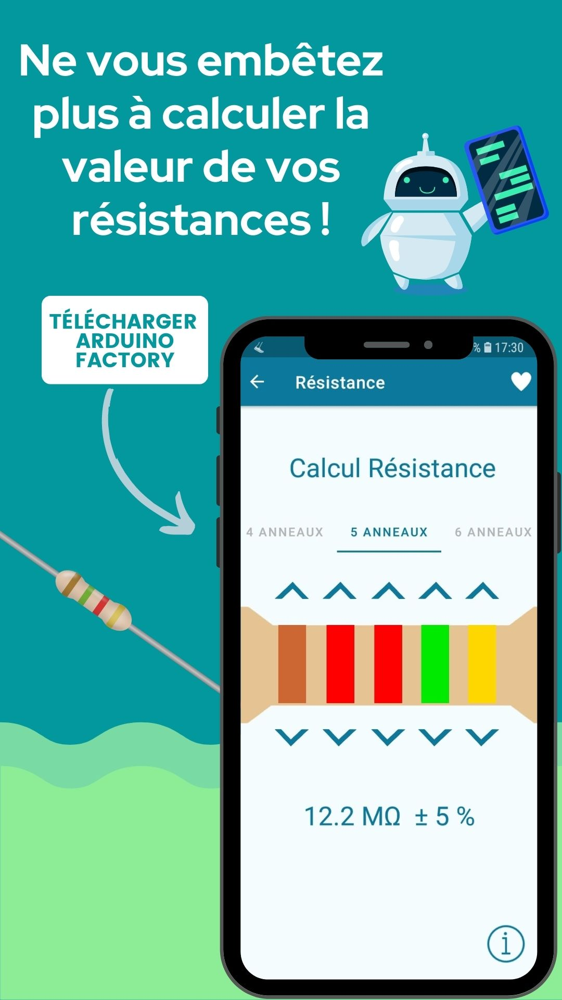
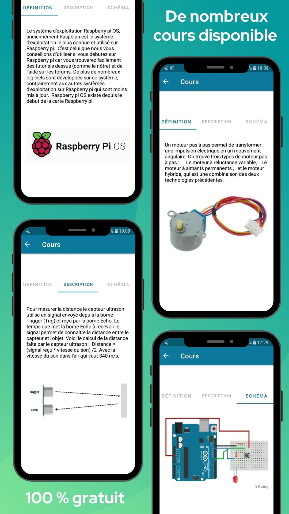
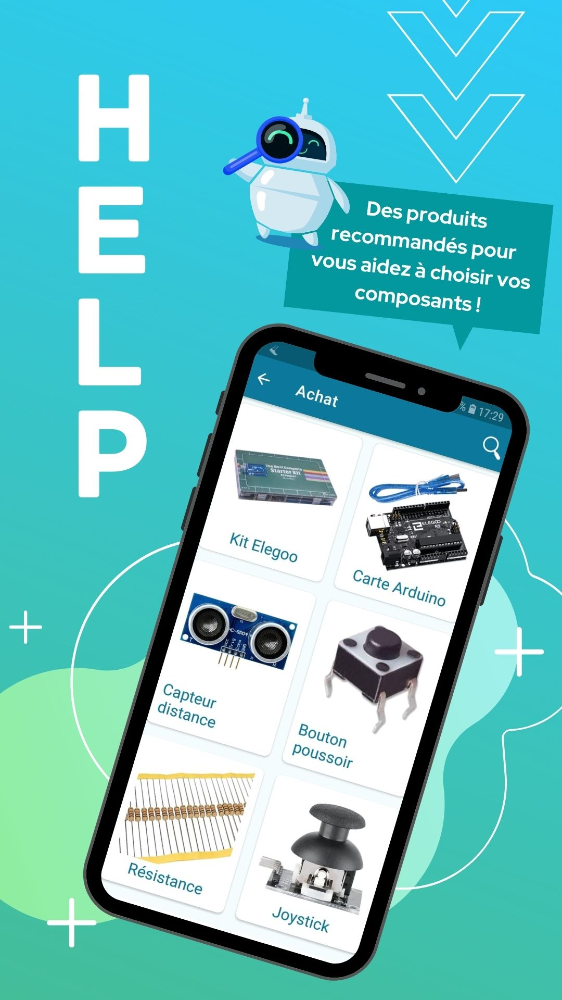

# Arduino Factory

Arduino Factory est application Android développée pour aider les utilisateurs à apprendre les
concepts de base de l'Arduino.

Avec notre application, vous serez en mesure de :
- Diriger vos robots en bluetooth depuis votre téléphone
- Identifier facilement les composants Arduino grâce à notre [IA de reconnaissance de composants](https://github.com/Kamomille/Reconnaissance_composants_arduino)
- Comprendre le fonctionnement des composants Arduino grâce à nos fiches de cours

| Image 1 | Image 2 | Image 3 | Image 4 | Image 5 |
|---------|---------|---------|---------|---------|
|  |  |  |  |  |

## Installation
Vous pouvez télecharger notre application sur votre appareil Android depuis
[le Google Play Store](https://play.google.com/store/apps/details?id=com.ArduinoFactory.androidstudio&gl=US).

## Assistance
Si vous rencontrez des problèmes ou avez des questions,
n'hésitez pas à consulter [notre site web](http://arduinofactory.fr/)
ou veuillez nous contacter à l'adresse arduinofactory@yahoo.com

## Equipe
* [Julien GOUBAN](https://github.com/juliengouban)
* [Camille BAYON DE NOYER](https://github.com/Kamomille)
* Cédric Chhuon
* Pierre Huruguen

